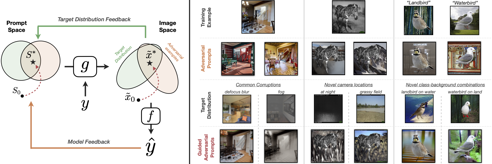

## Controlled Training Data Generation with Diffusion Models

[Teresa Yeo*](https://aserety.github.io), [Andrei Atanov*](https://andrewatanov.github.io/), [Harold Benoit^](https://www.haroldbenoit.com), [Aleksandr Alekseev^](), [Ruchira Ray](https://www.cs.utexas.edu/~ruchira/), [Pooya Esmaeil Akhoondi](), [Amir Zamir](https://vilab.epfl.ch/zamir/)

 [`Website`](https://adversarial-prompts.epfl.ch/) | [`arXiv`]() | [`BibTeX`](#citation)
 
[](https://adversarial-prompts.epfl.ch/)


## Abstract

In this work, we present a method to control a text-to-image generative model to produce training data specifically "useful" for supervised learning.
Unlike previous works that employ an open-loop approach and pre-define prompts to generate new data using either a language model or human expertise, we develop an automated **closed-loop** system which involves **two feedback mechanisms**. 
The first mechanism uses feedback from a given supervised model and finds **adversarial** prompts that result in image generations that maximize the model's loss.
While these adversarial prompts result in diverse data informed by the model, they are not informed of a target distribution, which can be inefficient.
Therefore, we introduce the second feedback mechanism that **guides** the generation process towards a certain target distribution.
We call the method combining these two mechanisms Guided Adversarial Prompts.
We perform our evaluations on different tasks, datasets and architectures, with different types of distribution shifts (spuriously correlated data, unseen domains) and demonstrate the efficiency of the proposed feedback mechanisms compared to open-loop approaches.


## Table of contents

This repository contains the code for performing adversarial optimization and data generation. The former is loosely based on code from the [diffusers repository](https://github.com/huggingface/diffusers/tree/main). Instructions for running the experiments in the paper can be found in the task folders.

- **[Depth Estimation](depth/README.md)**
  - (Guided) adversarial optimization
  - Dataset generation
  - More details in `depth`
- **[Classification](classification/README.md)**
  - (Guided) adversarial optimization
  - Dataset generation
  - More details in `classification`


### Environment setup

1. Clone the repo
```
git clone https://github.com/EPFL-VILAB/adversarial-prompts.git
cd adversarial-prompts
```

2. Create a new environment and install the required libraries.

```
yes | conda create --name adv_prompt python=3.8.13
conda activate adv_prompt
pip install -r requirements.txt
```

If you have problems after installing the requirements, please check the `install.sh` file that we used to setup the environment, which includes additional steps.

This will create a new conda environemtn called `adv_prompt`, containing all the necessary packages.


## Citation

```BibTeX
@article{yeo@Controlled,
  author    = {Yeo, Teresa and Atanov, Andrei and Benoit, Harold and Alekseev, Aleksandr and Ray, Ruchira and Esmaeil Akhoondi, Pooya and Zamir, Amir},
  title     = {Controlled Training Data Generation with Diffusion Models},
  journal   = {Arxiv},
  year      = {2023},
}
```

